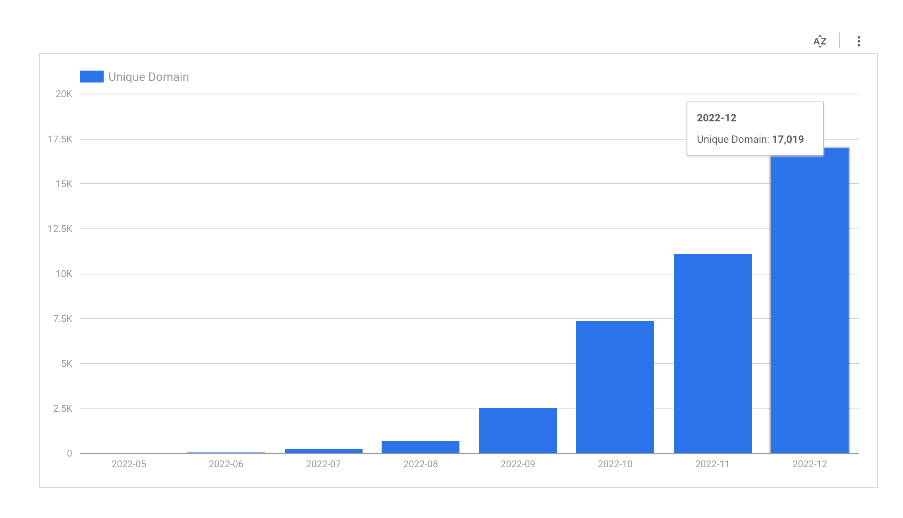

# Scam Sniffer Database
This repository contains a blacklist of domains and address maintained by [Scam Sniffer](https://scamsniffer.io/?utm_source=database).

## Blacklist

The blacklist directory contains two lists in JSON format:

- A full list of blacklisted domains: [`domains.json`](blacklist/domains.json)
- A full list of blacklisted address: [`address.json`](blacklist/address.json)

**NOTE:**  Blacklisted address stop updating since `2023-03-19`. If you need these data, please take look at our [Lookup API](https://docs.scamsniffer.io/apis/lookup-api)

## Used by
- [Forta Bot](https://explorer.forta.network/bot/0x8badbf2ad65abc3df5b1d9cc388e419d9255ef999fb69aac6bf395646cf01c14)
- [Phantom](https://phantom.app/)
- [Rabby](https://rabby.io/)
- [NFTGo](https://nftgo.io/)
- [Scam Sniffer Extension](https://chrome.google.com/webstore/detail/scam-sniffer/mnkbccinkbalkmmnmbcicdobcmgggmfc)
- [ChainAbuse](https://www.chainabuse.com/)
- [Pocket Universe](https://www.pocketuniverse.app/)

## Trends

## Where this data come from?
- [Detector API](https://docs.scamsniffer.io/api/detector-api) - Provide malicious website scanning service for web3 platform

## Update Frequency
Update daily and with 3 days delay. If you want the real-time result, Please take look at our [Lookup API](https://docs.scamsniffer.io/apis/lookup-api)

## Contact Us
- [Email](mailto:fun@scamsniffer.io) 

## Links
- [Twitter](https://twitter.com/realScamSniffer) 
- [Discord](https://discord.com/invite/UfrduBeefK)
- [GitHub](https://github.com/scamsniffer)
- [GitCoin](https://gitcoin.co/grants/6049/scam-sniffer)
- [WebSite](https://scamsniffer.io/?utm_source=git-repo)
